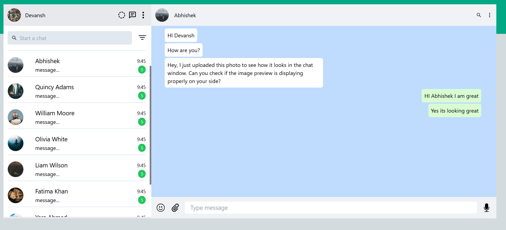
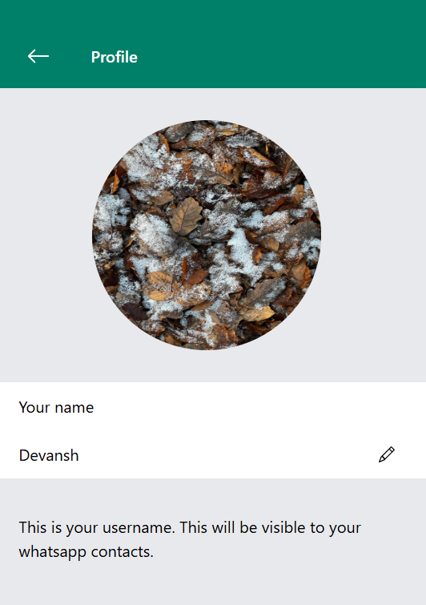
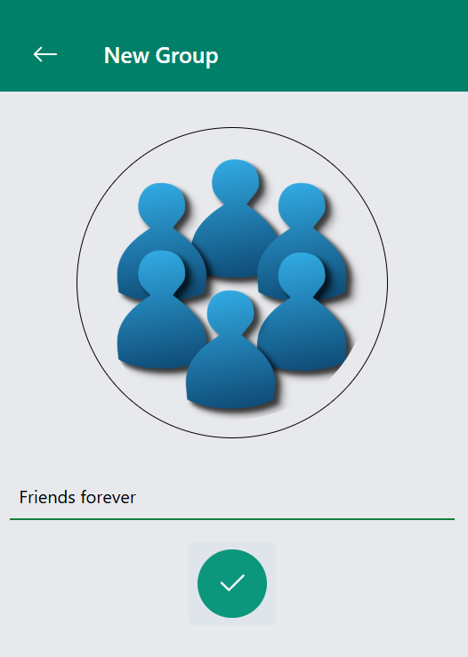
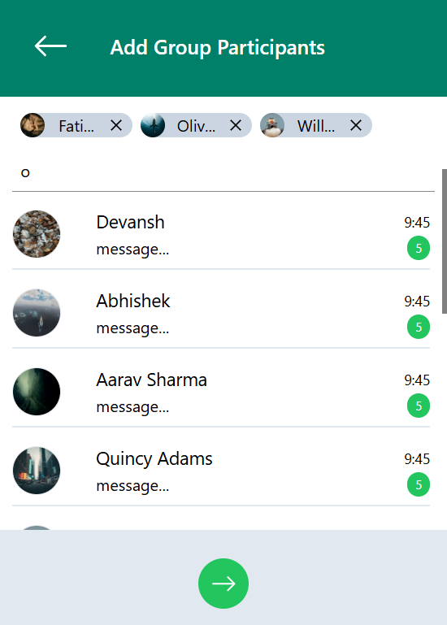

# ChatSphere


<p align="center">
  
  
  
</p>

---

A basic real-time chat application built for learning and practicing the core concepts of messaging systems, similar to WhatsApp. This project includes user authentication, 1-on-1 messaging, and real-time message updates.

## Features

- **User Authentication**: Secure JWT-based registration and login system.
- **Real-Time Messaging**: Instant messaging using WebSockets.
- **One-on-One & Group Chats**: Engage in private or group conversations.
- **Message History**: Persist chat history for future reference.
- **Delivery & Read Receipts**: Know when messages are delivered and read.
- **Online/Offline Status**: View user presence in real-time.
- **Responsive Design**: Optimized for various devices and screen sizes.([GitHub][1], [Medium][2])

* 🔐 User Registration & Login (JWT-based)
* 🧑‍🤝‍🧑 1-on-1 Real-Time Chat and group Chat
* 📥 Message History
* ✅ Message Seen & Delivery Status
* 🟢 Online/Offline Presence
* 📱 Responsive Frontend

---

## 🛠️ Tech Stack

### Backend

- Java + Spring Boot
- WebSocket (for real-time messaging)
- Spring Security (JWT Authentication)
- MySQL (Database)

### Frontend

- React.js / HTML-CSS-JS
- Socket.IO Client or WebSocket API

### Frontend

- **React.js**
- **Socket.IO Client** or native WebSocket API
- **HTML**, **CSS**, and **JavaScript**([GitHub][4])

### 1. Clone the repository

```bash
git clone https://github.com/your-username/chat-sphere.git
cd chat-sphere
```

### Prerequisites

- **Java Development Kit (JDK)** installed
- **Node.js** and **npm** installed
- **MySQL** database set up

### Backend Setup

1. **Clone the repository**:

   ```bash
   git clone https://github.com/Devansh-ds/Chat-app.git
   cd Chat-app/Backend/WhatsappClone
   ```

2. **Configure the database**:

   Update the `application.properties` file with your MySQL credentials:

   ```properties
   spring.datasource.url=jdbc:mysql://localhost:3306/chatsphere
   spring.datasource.username=your_username
   spring.datasource.password=your_password
   ```

- Practice WebSocket and real-time communication
- Design a basic chat system architecture

3. **Build and run the backend**:

   Use your preferred IDE to build and run the Spring Boot application.

### Frontend Setup

1. **Navigate to the frontend directory**:

   ```bash
   cd ../../Frontend
   ```

2. **Install dependencies**:

   ```bash
   npm install
   ```

3. **Start the frontend application**:

   ```bash
   npm start
   ```

The application will run at `http://localhost:3000`.

## Contributing

Contributions are welcome! Please fork the repository and submit a pull request for any enhancements or bug fixes.
